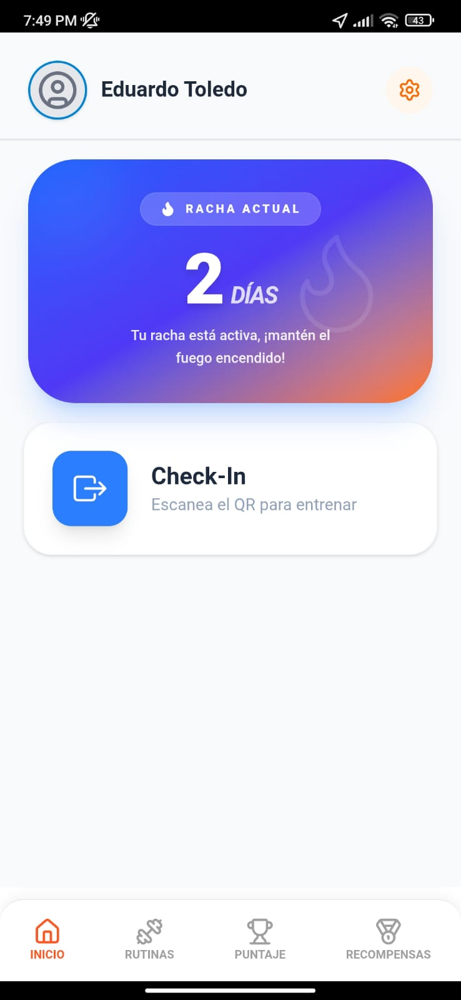
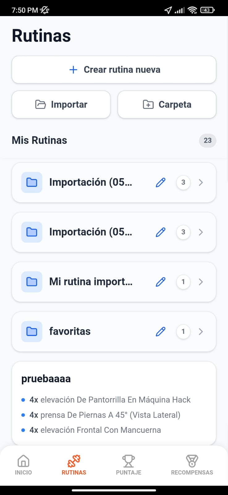
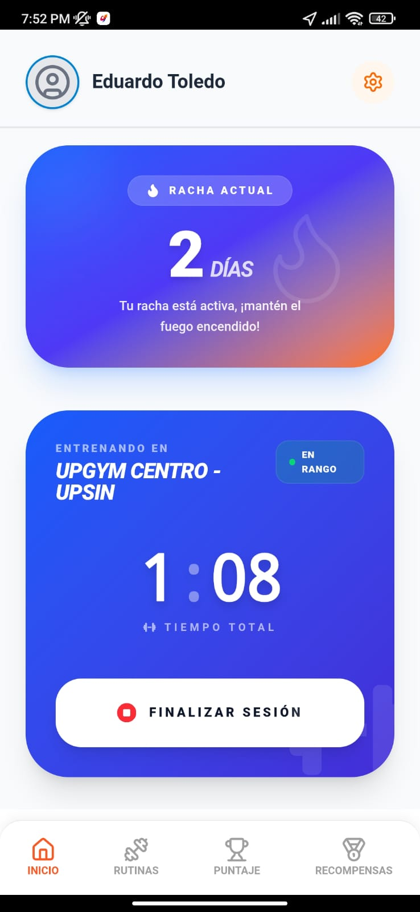
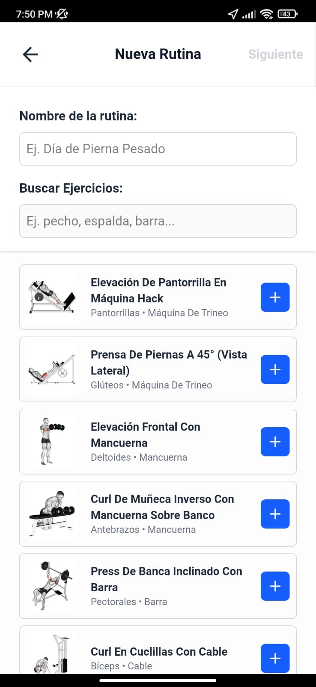
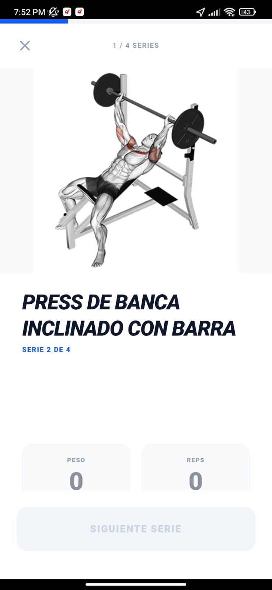
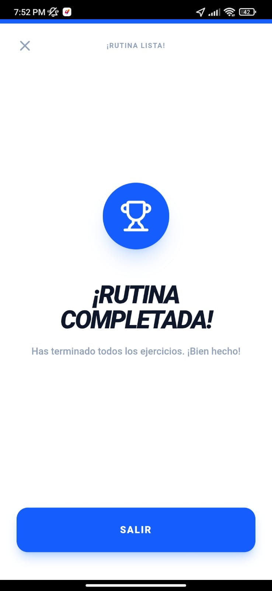
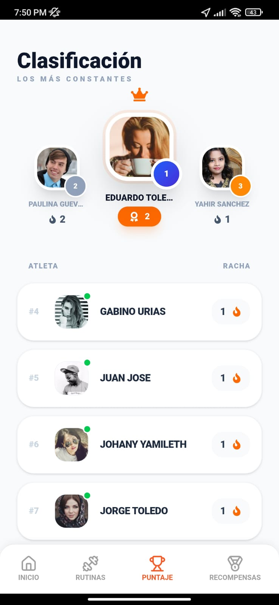
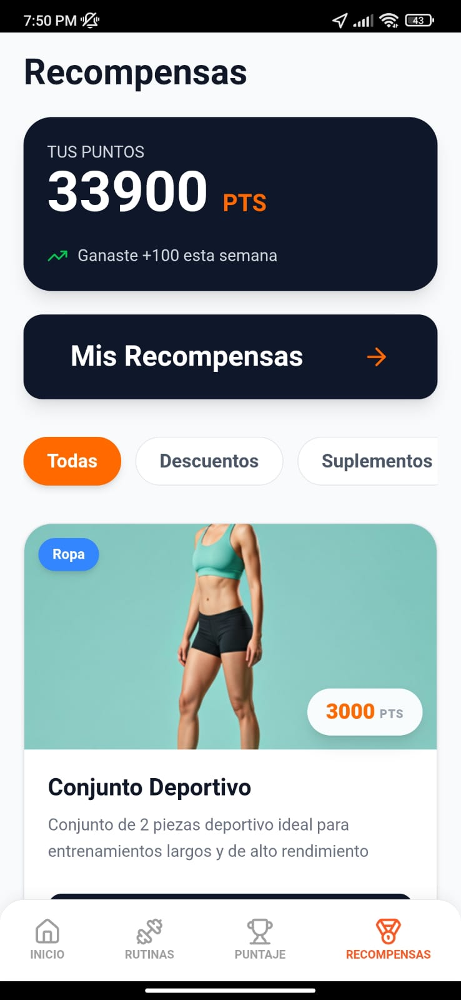
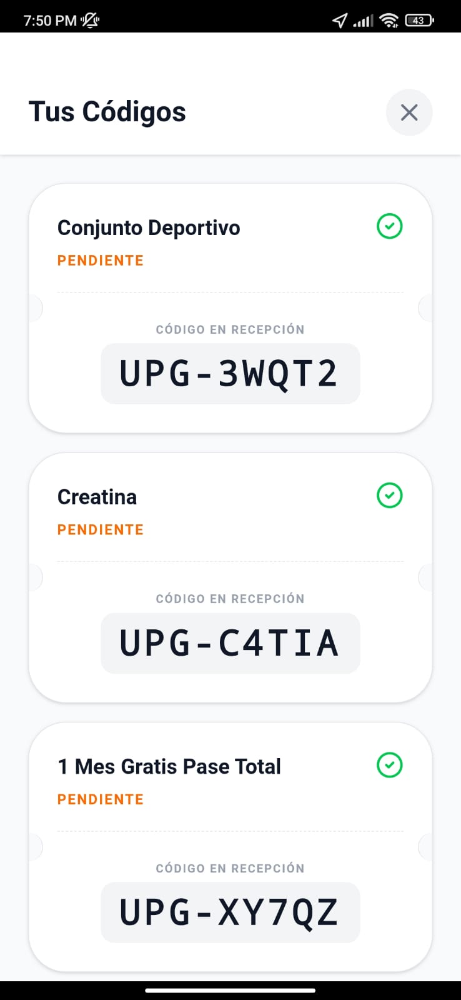

# 🏋️‍♂️ UpGym - Gestión de Entrenamiento y Fidelización

UpGym es una aplicación móvil híbrida diseñada para transformar la experiencia en el gimnasio. No es solo un tracker de rutinas; es un ecosistema completo que motiva a los usuarios a través de un sistema de **rachas dinámicas** y una **tienda de recompensas** integrada.

---

## 🚀 Características Principales

* **Check-in Inteligente:** Registro de asistencia mediante escaneo (simulado para demo) que activa el contador de racha.
* **Sistema de Rachas (Streaks):** Lógica automatizada en Base de Datos que premia la constancia diaria.
* **Tienda de Recompensas:** Los usuarios ganan puntos por entrenar y pueden canjearlos por productos reales (suplementos, ropa, descuentos).
* **Tickets de Canje:** Generación de códigos alfanuméricos únicos para validación física en la recepción del gimnasio.
* **Interfaz de Usuario (UI):** Diseño limpio, moderno y optimizado para dispositivos móviles usando Tailwind CSS.

---
---

## 📸 Vista Previa de la App (Screenshots)

Te presentamos una vista detallada de los flujos principales de UpGym. Las interfaces han sido diseñadas pensando en la usabilidad y la motivación del usuario.

 

### 🏃‍♂️ Sección 1: El Flujo de Entrenamiento y Check-in

  <table style="border-collapse: collapse; border: none;">
    <tr>
      <td align="center" style="border: none; padding: 10px;">
        
        
<strong>🏠 Panel de Inicio</strong> <small>Visualiza tus puntos y racha actual.</small>

      </td>
      <td align="center" style="border: none; padding: 10px;">
        
        
<strong>📋 Tus Rutinas</strong> <small>Explora tus planes de entrenamiento.</small>

      </td>
      <td align="center" style="border: none; padding: 10px;">
        
        
<strong>🎫 Check-in (Simulado)</strong> <small>Registro rápido para empezar a sumar.</small>

      </td>
    </tr>
    <tr>
      <td align="center" style="border: none; padding: 10px;">
        
        
<strong>➕ Nueva Rutina</strong> <small>Añade ejercicios y sets personalizados.</small>

      </td>
      <td align="center" style="border: none; padding: 10px;">
        
        
<strong>💪 Entrenamiento</strong> <small>Sigue tu racha y marca tu progreso.</small>

      </td>
      <td align="center" style="border: none; padding: 10px;">
        
        
<strong>🎉 ¡Misión Cumplida!</strong> <small>Racha y puntos actualizados al instante.</small>

      </td>
    </tr>
  </table>

 

### 🎁 Sección 2: El Sistema de Fidelización y Clasificación

  <table style="border-collapse: collapse; border: none;">
    <tr>
      <td align="center" style="border: none; padding: 10px;">
        
        
<strong>🏆 Clasificación</strong> <small>Compite con otros usuarios del gimnasio.</small>

      </td>
      <td align="center" style="border: none; padding: 10px;">
        
        
<strong>🎁 Tienda de Premios</strong> <small>Explora y canjea tus puntos acumulados.</small>

      </td>
      <td align="center" style="border: none; padding: 10px;">
        
        
<strong>🎟️ Tus Tickets</strong> <small>Códigos únicos para usar en recepción.</small>

      </td>
    </tr>
  </table>

 

> **Nota:** Estas imagenes son las vistas de la DEMO 1.0 y no representan el contenido final de la aplicación

---

## 🛠️ Stack Tecnológico

### Frontend
* **React + Vite:** Para una interfaz rápida y reactiva.
* **Tailwind CSS:** Estilizado moderno y responsivo.
* **Capacitor:** Para convertir la web app en una aplicación móvil nativa.

### Backend
* **Node.js & Express:** Servidor robusto para la API REST.
* **JWT (JSON Web Tokens):** Autenticación segura de usuarios.
* **Bcrypt:** Encriptación de contraseñas.

### Base de Datos (MySQL)
El corazón de UpGym reside en su lógica de base de datos para garantizar la integridad de los puntos y el stock:
* **Triggers:** Automatización del historial de puntos y actualización de stock en tiempo real al realizar canjes.
* **Stored Procedures:** Transacciones seguras para el procesamiento de reclamos de premios y manejo de rachas.
* **Funciones:** Consultas de saldo calculadas directamente en el motor de BD.

---

## 🏗️ Arquitectura de Seguridad (Demo Stage)

Para la versión actual, se han implementado medidas de integridad referencial:
* **Transacciones SQL:** Uso de `START TRANSACTION` y `FOR UPDATE` para prevenir condiciones de carrera (ej. dos usuarios canjeando el último premio al mismo tiempo).
* **Validación por Trigger:** Bloqueo de inserciones si el saldo de puntos es insuficiente o el premio está inactivo.
* **Protección de Rutas:** Middleware de autenticación que valida la identidad del usuario antes de cualquier movimiento de puntos.

---

## 👤 Autores
* **Jesús Eduardo Toledo Valdez.**
* **Yahir Fernando Sanchéz Delgado.**
* **Abransa Paulina Guevara Moran.** 
* **Gabino de Jesús Urias Escalante.**

---
*Este proyecto es una demo funcional desarrollada para fines académicos.*
